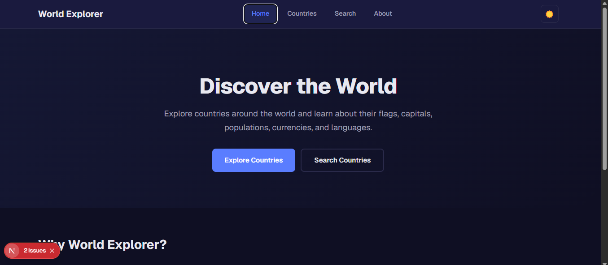
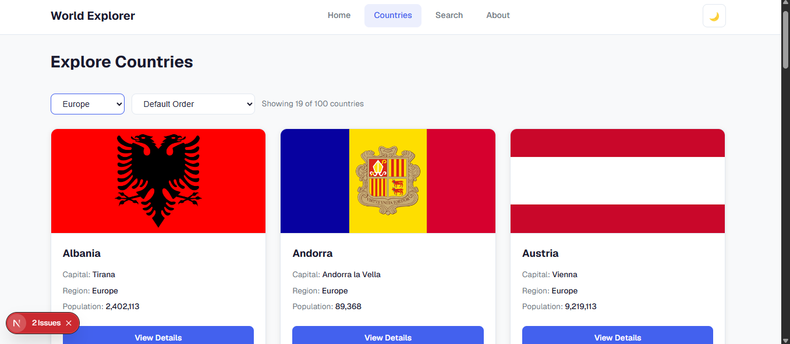
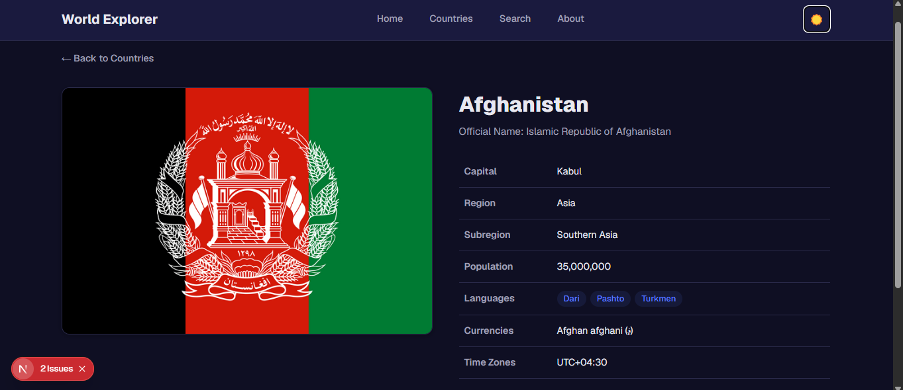
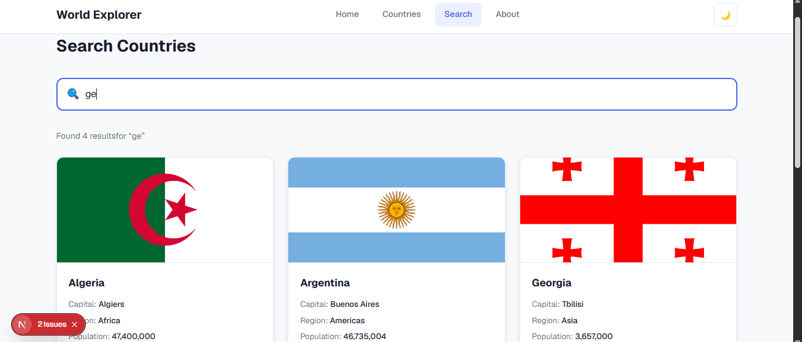

# 🌍 World Explorer

A modern and responsive country explorer built with Next.js. Browse countries, search by name, filter by region, and view detailed information powered by the REST Countries API.

---

## 📸 Project Preview

### Home Page

### Countries Page

### Country Details

### Search

> Save your screenshots inside a folder named screenshots in the project root.

---

## ✨ Features

- ⚡ Next.js App Router
- 📂 File-based Routing
- 🎨 Shared Layout
- 🔗 Dynamic Routes
- 🖥️ Server Components
- 💻 Client Components
- 🌐 REST Countries API Integration
- ⚡ Static Rendering & Caching
- 🔄 Dynamic Rendering
- 🔍 Search Countries
- 🌎 Filter by Region
- 📊 Sort by Population
- 🌙 Dark Mode
- 📱 Fully Responsive Design

---

## 🛠️ Tech Stack

- Next.js
- React
- TypeScript (if used)
- CSS / Tailwind CSS (replace with your styling method)
- REST Countries API

---

## 🌐 API

- https://restcountries.com

---

## 📄 Pages

| Route | Description |
|------|-------------|
| / | Home Page |
| /countries | Browse all countries |
| /countries/[code] | Country Details |
| /search | Search Countries |
| /about | About the Project |

---

## 🚀 Getting Started

npm install
npm run dev
Open:

http://localhost:3000
---

## 📦 Production Build

npm run build
npm start
---

## 📜 License

This project is created for learning purposes.
